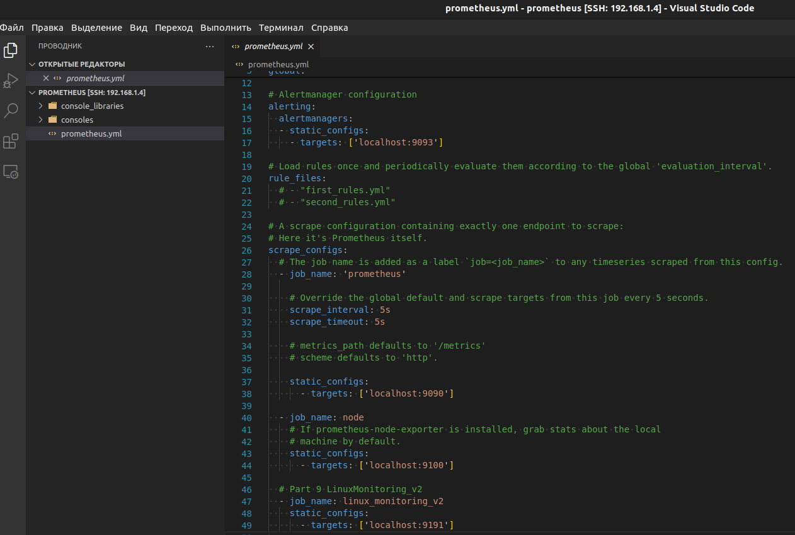
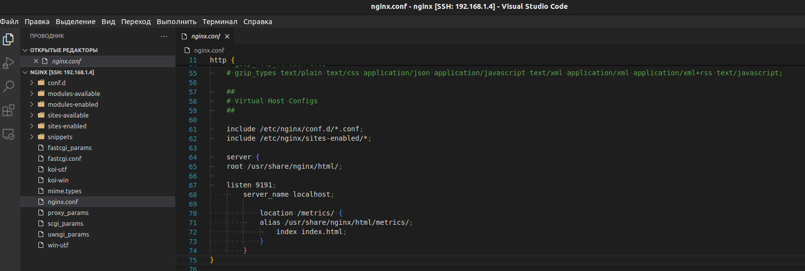
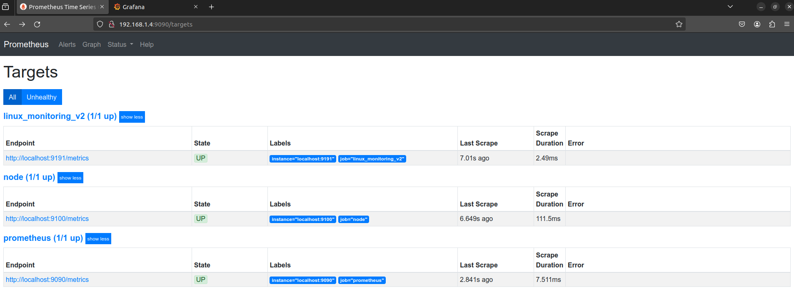
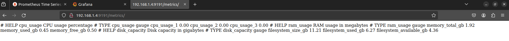
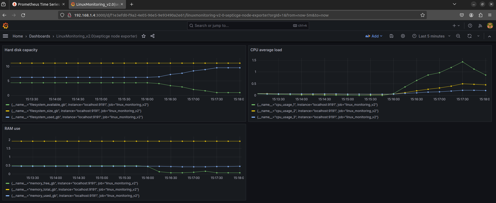
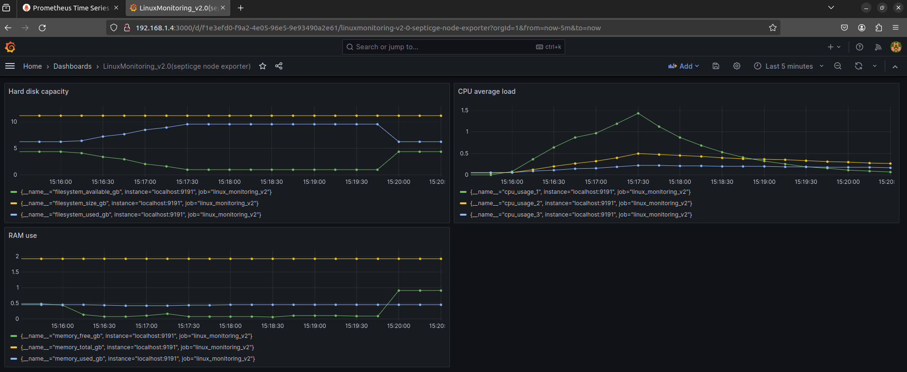
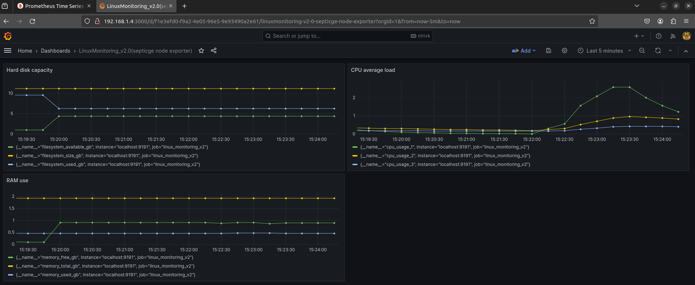

## Part 9. Свой *node_exporter*

##### Изменение конфигурационного файла **Prometheus** для сборки информации с созданной скриптом **main.sh** страницы.

- /etc/prometheus/prometheus.yml

- /etc/nginx/nginx.conf

- Prometheus:

- Метрики на `192.168.1.4:9191/metrics`

##### Проведение тестов из [Части 7](#part-7-prometheus-и-grafana)

## Запуск скрипта из 2 части

## Очистка скриптом из части 3

## Запуск стресс-теста

> `stress -c 2 -i 1 -m 1 --vm-bytes 32M -t 60s`

